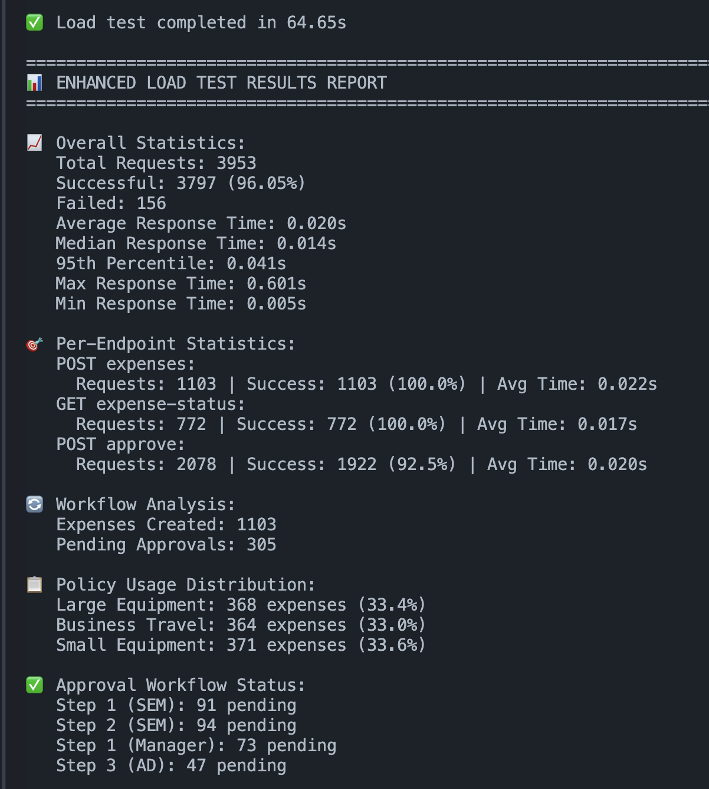

# DarwinBox POC - B2B Expense Tracker

A proof-of-concept expense management system with hierarchical approval workflows built with FastAPI and PostgreSQL.

## 🏗️ Architecture

- **Backend:** FastAPI (Python)
- **Database:** PostgreSQL 15
- **ORM:** SQLAlchemy 2.0+
- **Container:** Docker Compose

## 📋 Features

- ✅ Hierarchical organizational ## 🗄️ Database Schema

### Raw PostgreSQL Schema

```sqlture (7-level hierarchy)
- ✅ Policy-based expense categorization with amount thresholds
- ✅ Multi-step approval workflows
- ✅ Role-based authorization
- ✅ RESTful API with automatic documentation
- ✅ Real-time expense tracking and status updates

## 🚀 Quick Start

### Prerequisites

- Python 3.8+
- Docker and Docker Compose
- Git

### 1. Clone and Setup

```bash
# Clone the repository
git clone <repository-url>
cd darwin-box-poc

# Create virtual environment
python -m venv .venv
source .venv/bin/activate  # On Windows: .venv\Scripts\activate

# Install dependencies
pip install -r requirements.txt
```

### 2. Start Database

```bash
# Start PostgreSQL container
docker compose up -d

# Verify database is running
docker compose ps
```

### 3. Start Application

```bash
# Start the FastAPI server
python -m src.main
```

The server will start on `http://127.0.0.1:4000`

### 4. Populate Sample Data

```bash
# Run the data population script
python populate_data.py
```

This creates:
- 1 company (TechCorp Solutions)
- 1 team (Technology)
- 7 hierarchy levels (CTO → VP → Director → AD → SEM → Manager → SDE3)
- 7 users (one per level)
- 3 expense policies with approval workflows

## 📊 Sample Data Structure

### Users & Hierarchy
```
Level 1: Alice Chen (CTO)
Level 2: Bob Smith (VP)
Level 3: Carol Johnson (Director)
Level 4: David Wilson (AD - Associate Director)
Level 5: Eve Davis (SEM - Senior Engineering Manager)
Level 6: Frank Miller (Manager)
Level 7: Grace Taylor (SDE3 - Senior Software Engineer)
```

### Expense Policies
1. **Small Equipment** (under $2000) → Manager approval
2. **Large Equipment** (over $2000) → Manager → SEM → AD approval
3. **Business Travel** → Manager → SEM approval

## 🔧 API Endpoints

### Base URL: `http://127.0.0.1:4000`

#### 1. Create Expense
**POST** `/api/expenses`

Create a new expense against a policy.

```bash
curl -X POST "http://127.0.0.1:4000/api/expenses" \
  -H "Content-Type: application/json" \
  -d '{
    "user_id": 7,
    "policy_id": 1,
    "amount": 1200.00,
    "description": "New MacBook Pro for development"
  }'
```

#### 2. Approve Expense
**POST** `/api/expenses/approve`

Approve an expense step (only authorized personnel).

```bash
curl -X POST "http://127.0.0.1:4000/api/expenses/approve" \
  -H "Content-Type: application/json" \
  -d '{
    "expense_id": 1,
    "approver_id": 6,
    "comments": "Approved for team productivity"
  }'
```

#### 3. Get Expense Status
**GET** `/api/expenses/{expense_id}/status`

Get detailed status and approval progress.

```bash
curl -X GET "http://127.0.0.1:4000/api/expenses/1/status"
```

## 🧪 Testing Workflows

### Test Case 1: Single Approval (Small Equipment)

```bash
# 1. Create expense
curl -X POST "http://127.0.0.1:4000/api/expenses" \
  -H "Content-Type: application/json" \
  -d '{
    "user_id": 7,
    "policy_id": 1,
    "amount": 800.00,
    "description": "Development laptop"
  }'

# 2. Manager approves (Frank Miller - User ID 6)
curl -X POST "http://127.0.0.1:4000/api/expenses/approve" \
  -H "Content-Type: application/json" \
  -d '{
    "expense_id": 1,
    "approver_id": 6,
    "comments": "Standard equipment upgrade"
  }'

# 3. Check final status
curl -X GET "http://127.0.0.1:4000/api/expenses/1/status"
```

### Test Case 2: Multi-Step Approval (Large Equipment)

```bash
# 1. Create expensive equipment request
curl -X POST "http://127.0.0.1:4000/api/expenses" \
  -H "Content-Type: application/json" \
  -d '{
    "user_id": 7,
    "policy_id": 2,
    "amount": 4000.00,
    "description": "High-end workstation for ML projects"
  }'

# 2. Manager approval (Step 1)
curl -X POST "http://127.0.0.1:4000/api/expenses/approve" \
  -H "Content-Type: application/json" \
  -d '{
    "expense_id": 2,
    "approver_id": 6,
    "comments": "Justified for ML work"
  }'

# 3. SEM approval (Step 2)
curl -X POST "http://127.0.0.1:4000/api/expenses/approve" \
  -H "Content-Type: application/json" \
  -d '{
    "expense_id": 2,
    "approver_id": 5,
    "comments": "Supports team goals"
  }'

# 4. AD approval (Final step)
curl -X POST "http://127.0.0.1:4000/api/expenses/approve" \
  -H "Content-Type: application/json" \
  -d '{
    "expense_id": 2,
    "approver_id": 4,
    "comments": "Final approval granted"
  }'

# 5. Check final status
curl -X GET "http://127.0.0.1:4000/api/expenses/2/status"
```

## 📚 Interactive Documentation

Once the server is running, access the interactive API documentation:

- **Swagger UI:** http://127.0.0.1:4000/docs
- **ReDoc:** http://127.0.0.1:4000/redoc

## 🗂️ Project Structure

```
darwin-box-poc/
├── src/
│   ├── api/
│   │   ├── __init__.py
│   │   └── api.py              # API endpoints
│   ├── models/                 # SQLAlchemy models
│   │   ├── __init__.py
│   │   ├── company.py
│   │   ├── team.py
│   │   ├── hierarchy_level.py
│   │   ├── user.py
│   │   ├── policy.py
│   │   ├── approval_step.py
│   │   ├── expense.py
│   │   └── approval.py
│   ├── utils/
│   │   ├── __init__.py
│   │   └── log.py              # Logging configuration
│   ├── config.py               # Configuration
│   ├── database.py             # Database setup
│   └── main.py                 # FastAPI application
├── populate_data.py            # Sample data population
├── docker-compose.yml          # PostgreSQL container
├── requirements.txt            # Python dependencies
├── test.md                     # Detailed API testing guide
└── README.md                   # This file
```

## 🔒 Security Features

- **Authorization:** Only designated approvers can approve expenses
- **Company Isolation:** Users can only interact with expenses in their company
- **Step Validation:** Approval workflow follows configured steps
- **Self-Approval Prevention:** Users cannot approve their own expenses

## 🐛 Troubleshooting

### Database Connection Issues
```bash
# Check if PostgreSQL is running
docker compose ps

# View database logs
docker compose logs postgres

# Restart database
docker compose down -v && docker compose up -d
```

### API Not Responding
```bash
# Check if server is running
curl http://127.0.0.1:4000/

# Check server logs for errors
python -m src.main
```

### Reset Everything
```bash
# Stop all services and clear data
docker-compose down -v

# Restart database
docker-compose up -d

# Restart server
python -m src.main

# Repopulate data
python scripts/populate_data.py
```

## 📈 API Response Formats

### Success Response (Create Expense)
```json
{
  "message": "Expense created successfully",
  "expense_id": 1,
  "status": "pending",
  "amount": 1200.0,
  "approvals_required": [
    {
      "step": 1,
      "approver": "Frank Miller",
      "level": "Manager"
    }
  ]
}
```

### Success Response (Approve Expense)
```json
{
  "message": "Approval submitted successfully",
  "expense_id": 1,
  "step_approved": 1,
  "expense_status": "approved",
  "pending_approvals": 0
}
```

### Expense Status Response
```json
{
  "id": 1,
  "amount": 1200.0,
  "description": "New MacBook Pro for development",
  "status": "approved",
  "submitted_at": "2025-08-25T10:30:00.000Z",
  "completed_at": "2025-08-25T10:45:00.000Z",
  "user_name": "Grace Taylor",
  "policy_name": "Small Equipment",
  "approvals": [
    {
      "step_number": 1,
      "approver_name": "Frank Miller",
      "approver_level": "Manager",
      "status": "approved",
      "approved_at": "2025-08-25T10:45:00.000Z",
      "comments": "Approved for team productivity",
      "required": true
    }
  ]
}
```

## �️ Database Schema

### Raw PostgreSQL Schema

```sql
-- Companies table
CREATE TABLE companies (
    id SERIAL PRIMARY KEY,
    name VARCHAR(100) NOT NULL
);

-- Teams table
CREATE TABLE teams (
    id SERIAL PRIMARY KEY,
    company_id INTEGER NOT NULL REFERENCES companies(id),
    name VARCHAR(100) NOT NULL,
    is_company_wide BOOLEAN DEFAULT false,
    UNIQUE (company_id, name)
);
CREATE INDEX ix_teams_company_id ON teams(company_id);

-- Hierarchy levels table
CREATE TABLE hierarchy_levels (
    id SERIAL PRIMARY KEY,
    company_id INTEGER NOT NULL REFERENCES companies(id),
    team_id INTEGER NOT NULL REFERENCES teams(id),
    level_number INTEGER NOT NULL,
    level_name VARCHAR(100) NOT NULL,
    UNIQUE (company_id, team_id, level_number)
);
CREATE INDEX ix_hierarchy_levels_company_level ON hierarchy_levels(company_id, level_number);
CREATE INDEX ix_hierarchy_levels_team_level ON hierarchy_levels(team_id, level_number);

-- Users table
CREATE TABLE users (
    id SERIAL PRIMARY KEY,
    company_id INTEGER NOT NULL REFERENCES companies(id),
    team_id INTEGER NOT NULL REFERENCES teams(id),
    email VARCHAR(100) NOT NULL,
    name VARCHAR(255) NOT NULL,
    hierarchy_level_id INTEGER NOT NULL REFERENCES hierarchy_levels(id),
    active BOOLEAN DEFAULT true,
    UNIQUE (company_id, email)
);
CREATE INDEX ix_users_company_team ON users(company_id, team_id);
CREATE INDEX ix_users_hierarchy_level ON users(hierarchy_level_id);
CREATE INDEX ix_users_team_hierarchy ON users(team_id, hierarchy_level_id);

-- Policies table
CREATE TABLE policies (
    id SERIAL PRIMARY KEY,
    company_id INTEGER NOT NULL REFERENCES companies(id),
    category VARCHAR(50) NOT NULL,
    name VARCHAR(100) NOT NULL,
    description TEXT,
    min_amount DECIMAL(12,2) NOT NULL DEFAULT 0.00,
    max_amount DECIMAL(12,2) NOT NULL DEFAULT 999999999.99,
    created_at TIMESTAMP DEFAULT CURRENT_TIMESTAMP,
    active BOOLEAN DEFAULT true,
    UNIQUE (company_id, category, min_amount),
    CHECK (min_amount <= max_amount)
);
CREATE INDEX ix_policies_company_category ON policies(company_id, category);
CREATE INDEX ix_policies_amount_range ON policies(company_id, min_amount, max_amount);

-- Approval steps table
-- With this, the approval step can incorporate dynamic operations like escalation, escalation time out and so on
CREATE TABLE approval_steps (
    id SERIAL PRIMARY KEY,
    policy_id INTEGER NOT NULL REFERENCES policies(id),
    step_order INTEGER NOT NULL,
    required_level INTEGER NOT NULL,
    team_scope VARCHAR(20) NOT NULL DEFAULT 'submitter',
    is_required BOOLEAN DEFAULT true,
    description VARCHAR(255),
    UNIQUE (policy_id, step_order),
    CHECK (step_order > 0),
    CHECK (required_level BETWEEN 1 AND 10)
);
CREATE INDEX ix_approval_steps_policy_order ON approval_steps(policy_id, step_order);
CREATE INDEX ix_approval_steps_level_scope ON approval_steps(required_level, team_scope);

-- Expenses table
CREATE TABLE expenses (
    id SERIAL PRIMARY KEY,
    company_id INTEGER NOT NULL REFERENCES companies(id),
    user_id INTEGER NOT NULL REFERENCES users(id),
    policy_id INTEGER NOT NULL REFERENCES policies(id),
    amount DECIMAL(12,2) NOT NULL,
    description TEXT,
    status VARCHAR(20) DEFAULT 'pending',
    submitted_at TIMESTAMP DEFAULT CURRENT_TIMESTAMP,
    completed_at TIMESTAMP NULL
);
CREATE INDEX ix_expenses_company_user_submitted ON expenses(company_id, user_id, submitted_at);
CREATE INDEX ix_expenses_company_status ON expenses(company_id, status);

-- Approvals table
CREATE TABLE approvals (
    id SERIAL PRIMARY KEY,
    expense_id INTEGER NOT NULL REFERENCES expenses(id),
    step_number INTEGER NOT NULL,
    approver_id INTEGER NOT NULL REFERENCES users(id),
    approver_level_id INTEGER NOT NULL REFERENCES hierarchy_levels(id),
    required BOOLEAN DEFAULT true,
    status VARCHAR(20) DEFAULT 'pending',
    approved_at TIMESTAMP NULL,
    comments TEXT,
    UNIQUE (expense_id, step_number, approver_id)
);
CREATE INDEX ix_approvals_approver_status ON approvals(approver_id, status);
CREATE INDEX ix_approvals_expense_step ON approvals(expense_id, step_number);
```

## 🔍 Raw SQL Queries for API Operations

### 1. Create Expense API

**POST /api/expenses**

This endpoint performs the following SQL operations in sequence:

**Step 1: Validate User**
```sql
SELECT id, company_id, team_id, hierarchy_level_id 
FROM users 
WHERE id = $1 AND active = true;
```

**Step 2: Validate Policy**
```sql
SELECT id, company_id, min_amount, max_amount, name 
FROM policies 
WHERE id = $1 AND active = true;
```

**Step 3: Insert Expense**
```sql
INSERT INTO expenses (company_id, user_id, policy_id, amount, description, status, submitted_at)
VALUES ($1, $2, $3, $4, $5, 'pending', CURRENT_TIMESTAMP)
RETURNING id;
```

**Step 4: Get Approval Steps for Policy**
```sql
SELECT id, step_order, required_level, team_scope, is_required, description
FROM approval_steps 
WHERE policy_id = $1 
ORDER BY step_order;
```

**Step 5: Find Approver (Team Scope)**
```sql
SELECT u.id, u.name, u.hierarchy_level_id, hl.level_name
FROM users u
JOIN hierarchy_levels hl ON u.hierarchy_level_id = hl.id
WHERE u.company_id = $1 
  AND u.team_id = $2 
  AND hl.level_number <= $3 
  AND u.id != $4 
  AND u.active = true
ORDER BY hl.level_number ASC
LIMIT 1;
```

**Step 6: Insert Approval Records**
```sql
INSERT INTO approvals (expense_id, step_number, approver_id, approver_level_id, required, status)
VALUES ($1, $2, $3, $4, $5, 'pending');
```

### 2. Approve Expense API

**POST /api/expenses/approve**

This endpoint performs the following SQL operations in sequence:

**Step 1: Validate Expense**
```sql
SELECT id, company_id, status 
FROM expenses 
WHERE id = $1;
```

**Step 2: Validate Approver**
```sql
SELECT id, company_id, name 
FROM users 
WHERE id = $1 AND active = true;
```

**Step 3: Find Pending Approval**
```sql
SELECT id, step_number, required
FROM approvals 
WHERE expense_id = $1 
  AND approver_id = $2 
  AND status = 'pending';
```

**Step 4: Update Approval**
```sql
UPDATE approvals 
SET status = 'approved', 
    approved_at = CURRENT_TIMESTAMP, 
    comments = $3
WHERE id = $1;
```

**Step 5: Count Pending Required Approvals**
```sql
SELECT COUNT(*) 
FROM approvals 
WHERE expense_id = $1 
  AND required = true 
  AND status = 'pending';
```

**Step 6: Update Expense Status (if all approved)**
```sql
UPDATE expenses 
SET status = 'approved', 
    completed_at = CURRENT_TIMESTAMP 
WHERE id = $1;
```

### 3. Get Expense Status API

**GET /api/expenses/{id}/status**

This endpoint performs the following SQL operations:

**Step 1: Get Expense Details**
```sql
SELECT e.id, e.amount, e.description, e.status, e.submitted_at, e.completed_at,
       u.name as user_name, p.name as policy_name
FROM expenses e
JOIN users u ON e.user_id = u.id
JOIN policies p ON e.policy_id = p.id
WHERE e.id = $1;
```

**Step 2: Get All Approvals**
```sql
SELECT a.step_number, a.status, a.approved_at, a.comments, a.required,
       u.name as approver_name, hl.level_name as approver_level
FROM approvals a
JOIN users u ON a.approver_id = u.id
JOIN hierarchy_levels hl ON a.approver_level_id = hl.id
WHERE a.expense_id = $1
ORDER BY a.step_number;
```

## 🚀 Load Testing

### Overview

The project includes a comprehensive load testing script to evaluate API performance under various load conditions. The load tester simulates realistic user behavior across all three endpoints.

### Quick Start

**Option 1: Interactive Script**
```bash
# Run the interactive load test setup
./run_load_test.sh
```

**Option 2: Direct Execution**
```bash
# Install dependencies
pip install -r load_test_requirements.txt

# Run load test with default settings (10 users, 60s)
python3 load_test.py
```

### Test Scenarios

#### 1. Light Load Test
```bash
python3 load_test.py --users 5 --duration 30 --delay 0.2
```
- **Purpose**: Basic functionality validation
- **Users**: 5 concurrent users
- **Duration**: 30 seconds
- **Use Case**: Development testing, CI/CD pipelines

#### 2. Medium Load Test  
```bash
python3 load_test.py --users 10 --duration 60 --delay 0.1
```
- **Purpose**: Standard performance baseline
- **Users**: 10 concurrent users  
- **Duration**: 60 seconds
- **Use Case**: Regular performance monitoring

#### 3. Heavy Load Test
```bash
python3 load_test.py --users 25 --duration 120 --delay 0.05
```
- **Purpose**: Stress testing under sustained load
- **Users**: 25 concurrent users
- **Duration**: 2 minutes
- **Use Case**: Capacity planning, bottleneck identification

#### 4. Spike Test
```bash
python3 load_test.py --users 50 --duration 30 --delay 0.02
```
- **Purpose**: Peak traffic simulation
- **Users**: 50 concurrent users
- **Duration**: 30 seconds
- **Use Case**: Black Friday scenarios, viral traffic spikes

### Load Test Features

#### **Realistic User Simulation**
- **Mixed Workload**: 50% create, 30% approve, 20% status checks
- **Intelligent Data**: Uses sample data matching your database
- **Workflow Simulation**: Creates expenses, then approves them
- **Ramp-up**: Gradual user increase to avoid thundering herd

#### **Comprehensive Metrics**
- **Response Time Statistics**: Mean, median, 95th percentile, min/max
- **Success Rate Analysis**: Request success/failure breakdown
- **Per-Endpoint Metrics**: Individual endpoint performance
- **Error Analysis**: Detailed error categorization
- **Performance Thresholds**: Automated performance assessment

#### **Command Line Options**
```bash
python3 load_test.py --help

Options:
  --url URL         Base URL of the API (default: http://127.0.0.1:4000)
  --users USERS     Number of concurrent users (default: 10)
  --duration DURATION  Test duration in seconds (default: 60)
  --rampup RAMPUP   Ramp-up time in seconds (default: 5)
  --delay DELAY     Delay between requests per user (default: 0.1)
```

### Sample Test Output

```
🚀 Starting Load Test for DarwinBox POC
📊 Configuration:
   - Base URL: http://127.0.0.1:4000
   - Concurrent Users: 10
   - Test Duration: 60s
   - Ramp-up Time: 5s
   - Request Delay: 0.1s

✅ API server connectivity confirmed
🏃 Starting load test simulation...

✅ Load test completed in 62.15s

============================================================
📊 LOAD TEST RESULTS REPORT
============================================================

📈 Overall Statistics:
   Total Requests: 2847
   Successful: 2834 (99.54%)
   Failed: 13
   Average Response Time: 0.156s
   Median Response Time: 0.134s
   95th Percentile: 0.298s
   Max Response Time: 1.234s
   Min Response Time: 0.045s

🎯 Per-Endpoint Statistics:
   POST expenses:
     Requests: 1424 | Success: 1420 (99.72%) | Avg Time: 0.187s
   POST approve:
     Requests: 853 | Success: 851 (99.77%) | Avg Time: 0.143s
   GET status:
     Requests: 570 | Success: 563 (98.77%) | Avg Time: 0.098s

💡 Recommendations:
   ✅ Performance looks good!
============================================================
```

### Performance Benchmarks

#### **Expected Performance Targets**
- **Success Rate**: > 95%
- **Average Response Time**: < 500ms
- **95th Percentile**: < 1000ms
- **Concurrent Users**: 10-25 users sustained

#### **Performance Indicators**
- **Green**: Success rate > 95%, avg response < 500ms
- **Yellow**: Success rate 90-95%, avg response 500-1000ms
- **Red**: Success rate < 90%, avg response > 1000ms

### Load Testing Best Practices

#### **Before Running Tests**
1. **Start Services**: Ensure API and database are running
2. **Populate Data**: Run `python scripts/populate_data.py`
3. **Baseline**: Run light load test first
4. **Monitor Resources**: Watch CPU, memory, database connections

#### **Interpreting Results**
- **Response Time Spikes**: Check database query performance
- **High Error Rates**: Investigate connection limits, database locks
- **Memory Issues**: Monitor application memory usage
- **Database Performance**: Check PostgreSQL logs and query plans

#### **Scaling Considerations**
- **Database Connections**: Tune PostgreSQL `max_connections`
- **Application Threads**: Adjust FastAPI worker processes
- **Caching**: Consider Redis for session management
- **Load Balancing**: Use nginx for multiple app instances



Note: Failed cases are because the script was trying approve expenses that did not exist.

### Troubleshooting Load Tests

#### **Common Issues**

**Connection Refused**
```bash
# Check if API server is running
curl http://127.0.0.1:4000/

# Start the server if needed
python -m src.main
```

**Database Connection Errors**
```bash
# Check database status
docker compose ps

# Restart database if needed
docker compose restart postgres
```

**High Error Rates**
```bash
# Check server logs for errors
python -m src.main

# Monitor database connections
docker exec -it postgres psql -U darwinbox_user -d darwinbox_db -c "SELECT * FROM pg_stat_activity;"
```

---

For detailed API testing examples, see [test.md](test.md)
